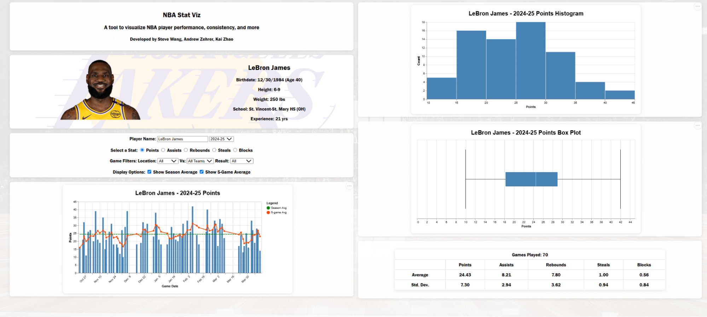

# NBA Stats Visualization Dashboard

An interactive web application to explore and analyze NBA player performance, consistency, and game-level statistics. Built with **Flask**, **Vega-Lite**, and **nba_api**, this tool is designed for fantasy players, bettors, analysts, and fans who want to dive deeper into player trends across the season.

## Features

- Visualizations of **game-by-game stats** (points, assists, rebounds, steals, blocks)
- Dynamic **filtering** by opponent, location (home/away), and win/loss
- Multiple chart types:
  - **Bar charts** with seasonal overlays
  - **Rolling averages** (5-game)
  - **Box plots** to assess variance
  - **Histograms** for distribution insight
- Season dropdown auto-loaded from NBA history
- Player bio with headshot, team info, and age calculation
- Autocomplete search across active and retired players

## Setup Instructions

### 1. Clone the Repository and Navigate to Project Folder
```
git clone https://github.com/andrewzehrer/csce679_final_project.git

cd csce679_final_project
```


### 2. Dependencies

Make sure the following are installed on your system:

- Python >= 3.7
- Node.js >= 16
- npm >= 8
- pip (Python package installer) – comes with Python 3 (`pip3 --version`)


Create virtual environment and install all project dependencies:

```
python3 -m venv venv

source venv/bin/activate  # macOS/Linux
# OR
.\venv\Scripts\Activate   # Windows PowerShell
# OR
venv\Scripts\activate.bat # Windows CMD

pip install -r requirements.txt
```

### 3. Start the Application inside venv

```
npm start 
```
### 4. Open in your browser

Your app should now be live at: http://localhost:8800




## Project Structure
```
csce679_final_project/
├── data_processing/
│   └── backend.py        # Flask API backend
├── public/
│   ├── index.html        # Main HTML interface
│   ├── scripts.js        # Frontend logic + Vega-Lite
│   ├── styles.css        # Custom styles
│   └── webview.png       # Demo preview image
├── requirements.txt      # Python dependencies
└── README.md             # Project Setup and Structure
```

## Contributors

Steve Wang: https://github.com/SteveWang110 

Andrew Zeher: https://github.com/andrewzehrer

Kai Zhao: https://github.com/kaiqizhao96 